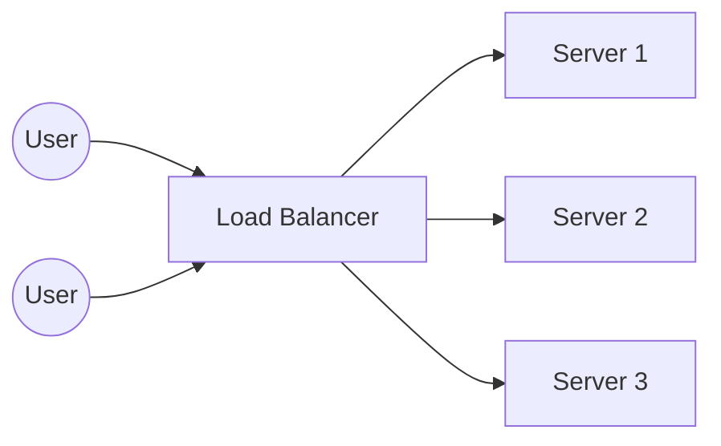

## 1.2 Scalability Fundamentals

Scalability is the ability of a system to handle increased load without degrading performance disproportionately.
It is not just about "working"; it is about working *well* under pressure.

Scalability must be designed in, not added later.

---

### 1.2.1 What Scalability Means

In simple terms, if your system serves 100 users today, can it serve 1 million users tomorrow if you give it more hardware? If the answer is "no" (because the code locks up, or the database chokes), the system is not scalable.

**Why is it needed?**
Systems face growth in several dimensions:
- **Traffic:** More users hitting the "Buy" button at once.
- **Data:** Storing terabytes instead of gigabytes.
- **Complexity:** More features interacting with each other.

**What happens if ignored?**
- **Downtime:** The site crashes during peak events (e.g., Black Friday).
- **Latency:** Pages take 10 seconds to load, causing users to leave.
- **Financial Loss:** Amazon calculated that 100ms of latency cost them 1% in sales.

**Example:**
Imagine a ticket booking site for a popular concert.
- **Non-scalable:** The server crashes the moment tickets go on sale because it can't handle 50,000 concurrent connections.
- **Scalable:** The system automatically adds more servers to handle the rush, and users experience a smooth queue.

---

### 1.2.2 Vertical vs Horizontal Scaling

There are two main ways to scale a system.

#### Vertical Scaling (Scale Up)

This involves adding more power (CPU, RAM, Disk) to an existing machine.

**Analogy:** You have a car that can't carry enough people. You trade it in for a bigger bus.

```text
[  Small Server  ]  --->  [  HUGE SERVER  ]
```

**Implementation:**
- Upgrading an AWS EC2 instance from `t2.micro` (1 vCPU, 1GB RAM) to `m5.24xlarge` (96 vCPUs, 384GB RAM).
- Increasing the RAM allocation for a database server.

**Pros:**
- **Simplicity:** No code changes required. You just pay for a better machine.
- **Communication:** Everything runs in the same memory space, so it's fast.

**Cons:**
- **Hardware Limits:** There is a maximum limit to how much RAM or CPU a single machine can have.
- **Single Point of Failure:** If that one massive server crashes, the whole system dies.
- **Cost:** High-end hardware is disproportionately expensive.

**Use Case:** Great for small applications or initial database scaling where complexity needs to be low.

---

#### Horizontal Scaling (Scale Out)

This involves adding more machines (nodes) to a pool of resources.

**Analogy:** You have a car that can't carry enough people. You buy 5 more cars and hire drivers.

```text
[  Server  ]  --->  [  Server  ] + [  Server  ] + [  Server  ]
```

**Implementation:**
- Adding 10 more web servers behind a Load Balancer.
- Using a distributed database like Cassandra or MongoDB that spreads data across many nodes.

**Pros:**
- **Infinite Scale:** Theoretically, you can keep adding servers forever.
- **Resilience:** If one server dies, the others keep working.
- **Cost-Effective:** You can use many cheap, commodity machines instead of one supercomputer.

**Cons:**
- **Complexity:** Requires load balancers, service discovery, and careful data management.
- **Network Latency:** Services talk over the network, which is slower than memory.

**Rule:** Real, massive scalability almost always comes from horizontal scaling.

---

### 1.2.3 Stateless vs Stateful Services

To scale horizontally, you must understand state.

#### Stateless Services
A stateless service does not keep any user data (state) in its local memory between requests. Every request is treated as independent.

**How it works:**
The client sends a request containing all necessary info (e.g., a JWT token identifying the user). The server processes it and forgets it.

**Example:**
- **REST API:** A user requests `GET /profile`. The request includes a token. Server A validates the token, fetches data from the DB, and responds. If the user sends the next request to Server B, Server B can handle it just as well.

**Why it scales:**
You can add 100 new servers instantly. Since they don't need to know "what happened 5 minutes ago," any server can help any user.

---

#### Stateful Services
A stateful service remembers the client's data from previous requests in local memory or disk.

**How it works:**
The user logs in. The server creates a "Session" object in its RAM. Future requests must go to *this exact server* because that's where the session lives.

**Example:**
- **Online Game Server:** The server holds the real-time position of the player in memory. If the player connects to a different server, that server won't know where they are.
- **Legacy Web Apps:** Storing `JSESSIONID` in the web server's memory.

**Why it's hard to scale:**
- **Sticky Sessions:** You need a load balancer that ensures User A always goes to Server 1.
- **Fragility:** If Server 1 crashes, User A loses their session (logged out).

**Rule:** Prefer stateless services for the application layer. Store state in external stores like Redis or Postgres.

---

### 1.2.4 Load Balancing

A Load Balancer (LB) is a device or software that sits between the client and a group of backend servers. It acts as a "traffic cop," distributing incoming network traffic across multiple servers to ensure no single server bears too much load.

**How it actually works:**
Most modern load balancers act as a **Reverse Proxy**.
1.  **Interception:** The client sends a request to the Load Balancer's IP address, thinking it is the actual server.
2.  **Selection:** The LB selects a healthy backend server based on an algorithm (like Round Robin).
3.  **Forwarding:** The LB forwards the request to the selected backend server.
4.  **Response:** The backend server processes the request and sends the response back to the LB.
5.  **Reply:** The LB sends the response back to the client.

Crucially, the LB performs **Health Checks**. It regularly pings backend servers (e.g., every 5 seconds). If a server doesn't respond, the LB marks it as "Unhealthy" and stops sending traffic there until it recovers.

**Why is it used?**
1.  **Scalability:** Allows you to add more servers to the backend pool seamlessly.
2.  **Availability:** If a server goes down, the LB stops sending traffic to it, preventing errors for users.
3.  **Flexibility:** You can take servers offline for maintenance without downtime.

**Graphical Representation:**



---

#### Types of Load Balancers

**1. Layer 4 (Transport Layer)**
- **How it works:** Looks at IP addresses and TCP ports. It forwards packets without inspecting the content.
- **Pros:** Extremely fast, handles millions of connections.
- **Cons:** Can't make decisions based on the URL or headers.
- **Use Case:** TCP traffic, database load balancing.

**2. Layer 7 (Application Layer)**
- **How it works:** Looks at the HTTP request (URL, Headers, Cookies).
- **Pros:** Smart routing. Can send `/images` to one server group and `/api` to another. Can terminate SSL.
- **Cons:** Slower than L4 because it has to decrypt and inspect data.
- **Use Case:** Web applications, Microservices gateways (e.g., Nginx, HAProxy, AWS ALB).

---

#### Load Balancing Algorithms

How does the LB decide which server gets the request?

1.  **Round Robin**
    - **Concept:** Requests are sent sequentially (1, 2, 3, 1, 2...).
    - **Best For:** When all servers have similar specifications (CPU/RAM).

2.  **Least Connections**
    - **Concept:** Sends the request to the server with the fewest active connections.
    - **Best For:** When requests take varying amounts of time (e.g., a video upload vs a text chat). It prevents one server from getting clogged with heavy tasks.

3.  **IP Hash**
    - **Concept:** A mathematical formula on the client's IP address determines the server. User A will *always* go to Server 1.
    - **Best For:** Stateful applications where a user needs to stay on the same server (Sticky Sessions).

4.  **Weighted Round Robin**
    - **Concept:** Administrators assign a "weight" to servers. A powerful server gets 2x or 3x the traffic of a weaker one.
    - **Best For:** A mixed fleet of old and new servers.

---

### 1.2.5 Auto-Scaling

Auto-scaling is the automated process of adding or removing servers based on real-time demand.

**How it works:**
You define an "Auto Scaling Group" (ASG) with a minimum and maximum number of servers. You set policies (triggers).

**Triggers:**
- **CPU Utilization:** "If average CPU > 70%, add 2 servers."
- **Request Count:** "If requests > 1000/sec, add 1 server."
- **Time Based:** "Every morning at 9 AM, double the servers."

**Example:**
Netflix uses auto-scaling to handle massive traffic in the evening (when people watch TV) and scale down at night to save money.

---

### 1.2.6 Bottlenecks & SPOFs

**Bottlenecks**
A bottleneck is the slowest part of your system that limits total capacity.
- **Example:** You have 100 fast web servers, but they all write to a single slow database. The database is the bottleneck. Adding more web servers won't help.
- **Fix:** Cache data, shard the database, or optimize queries.

**Single Point of Failure (SPOF)**
A component which, if it fails, stops the entire system from working.
- **Examples:**
    - A single Load Balancer without a backup.
    - A master database without a replica.
    - Hardcoded dependency on a 3rd party API.
- **Fix:** Redundancy. Have a standby Load Balancer (Active-Passive). Use database replication.

---

### 1.2.7 Scaling Databases

Scaling the data layer is harder than the application layer because data has "gravity" (it's hard to move).

1.  **Read Replicas:**
    - One "Master" DB handles writes.
    - Multiple "Slave" DBs handle reads.
    - **Use Case:** Read-heavy apps (e.g., Twitter, News sites).

2.  **Sharding (Partitioning):**
    - Splitting data across multiple servers.
    - **Example:** Users A-M go to DB Server 1, Users N-Z go to DB Server 2.
    - **Pros:** Unlimited write scaling.
    - **Cons:** Complex joins and transactions become very hard.

3.  **NoSQL:**
    - Using databases designed for horizontal scaling (Cassandra, DynamoDB) which handle sharding automatically.

---

### 1.2.8 Scaling Is Not Just Servers

Adding servers is only one piece of the puzzle. To truly scale, you need:

1.  **Caching:**
    - Store frequent results in RAM (Redis/Memcached).
    - **Example:** Instead of querying the DB for "Product Details" every time, check Redis first. This reduces DB load by 90%.

2.  **Asynchronous Processing:**
    - Don't do heavy work while the user waits.
    - **Example:** When a user signs up, don't send the Welcome Email immediately. Put a message in a Queue (RabbitMQ). A background worker sends the email later. This keeps the signup API fast.

3.  **Content Delivery Network (CDN):**
    - Serve static files (images, CSS, video) from servers close to the user.
    - **Example:** A user in London downloads images from a London server, not your main server in New York.

4.  **Rate Limiting:**
    - Prevent one user from overwhelming the system.
    - **Example:** "Max 100 requests per minute per IP."
