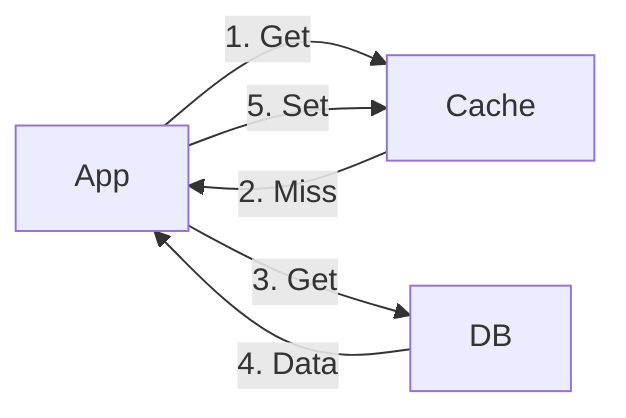
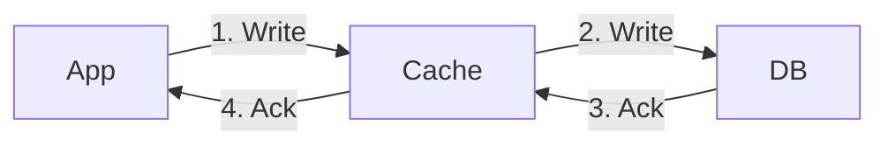

## 1.4 Caching (System Design View)

Caching is the technique of storing copies of frequently accessed data in a temporary storage location (the cache) that is faster to access than the primary source (like a database or remote API).

It is one of the most effective ways to improve system performance.

---

### 1.4.1 Why Caching Exists

The primary motivation for caching is the massive speed difference between different types of storage.

**The Latency Hierarchy:**
-   **L1/L2 Cache (CPU):** ~1-5 nanoseconds
-   **RAM (Memory):** ~100 nanoseconds
-   **SSD (Disk):** ~150,000 nanoseconds (0.15 ms)
-   **Network Call (Same Region):** ~500,000 nanoseconds (0.5 ms)
-   **Network Call (Cross Region):** ~100,000,000 nanoseconds (100 ms)

**Why it is needed:**
1.  **Reduce Latency:** Reading from memory (Redis) is thousands of times faster than executing a complex SQL query on disk.
2.  **Reduce Database Load:** Databases are hard to scale. Caching absorbs read traffic, protecting the database from being overwhelmed.
3.  **Cost Efficiency:** Scaling a cache (Redis) is often cheaper than scaling a high-performance relational database (like Oracle or RDS) to handle the same read throughput.

**What happens without it?**
-   **Bottlenecks:** The database hits 100% CPU utilization under load.
-   **High Latency:** Users experience slow page loads (e.g., > 2 seconds).
-   **Cascading Failures:** If the database slows down, application servers waiting for responses pile up, eventually crashing the web layer.

---

### 1.4.2 What Is a Cache?

**Analogy:**
Imagine a library.
-   **The Database:** The stacks of books in the basement. It contains everything, but it takes 10 minutes to go down, find a book, and bring it up.
-   **The Cache:** A backpack you carry. It can only hold 5 books.
-   **The Process:** When you need a book, you check your backpack first (Cache Hit). It takes 1 second. If it's not there, you go to the basement (Cache Miss), bring it up, and put it in your backpack for next time.

**Technical Examples:**
-   **Redis / Memcached:** In-memory key-value stores used for backend caching.
-   **Browser Cache:** Stores images and CSS locally on your laptop so you don't download them again.
-   **CPU Cache:** Stores instructions the processor is about to execute.

---

### 1.4.3 Where Can Caching Happen?

Caching can be implemented at multiple layers of the stack.

#### 1. Client-Side Caching
The data is stored on the user's device (Browser, Mobile App).

-   **How it works:** HTTP Headers (`Cache-Control: max-age=3600`) tell the browser to keep a file for 1 hour.
-   **Pros:**
    -   **Zero Latency:** Data is already on the device.
    -   **Zero Server Load:** The request never hits your network.
-   **Cons:**
    -   **Hard to Invalidate:** If you deploy a bug fix to a JS file, users with the cached version won't see it until the cache expires.
-   **Use Cases:** Static assets (logos, CSS, fonts), User preferences.

#### 2. CDN Caching (Content Delivery Network)
Data is stored on servers distributed globally (the "Edge"), closer to the user.

-   **How it works:** A user in London requests an image. Instead of hitting your server in New York, they hit a Cloudflare server in London.
-   **Pros:**
    -   **Reduced Latency:** Shorter physical distance for data to travel.
    -   **DDoS Protection:** CDNs absorb massive traffic spikes.
-   **Cons:**
    -   **Cost:** CDNs charge for bandwidth.
    -   **Propagation Delay:** Updating a file might take minutes to reach all global nodes.
-   **Use Cases:** HTML pages, Images, Videos, JS bundles.

#### 3. Server-Side Caching
Data is stored on your infrastructure, usually in front of the database.

-   **Types:**
    -   **Local Cache (In-Memory):** Stored in the RAM of the web server itself (e.g., Java Heap, Python Dictionary). Fast, but if the server restarts, data is lost. Data is duplicated across servers.
    -   **Distributed Cache (Global):** A separate cluster (e.g., Redis) shared by all web servers. Slower than local (network hop), but consistent across all servers.
-   **Pros:**
    -   **Control:** You have full control over eviction and invalidation logic.
    -   **Consistency:** A distributed cache ensures all servers see the same data.
-   **Cons:**
    -   **Complexity:** Requires maintaining additional infrastructure (Redis cluster).
-   **Use Cases:** Database query results, User sessions, API responses.

---

### 1.4.4 Cache Access Patterns

How the application interacts with the cache and the database.

#### 1. Cache-Aside (Lazy Loading)
The application is responsible for reading and writing from the cache.

**Flow:**
1.  App checks Cache.
2.  If **Hit**: Return data.
3.  If **Miss**: App queries Database.
4.  App writes data to Cache.
5.  Return data.

-   **Pros:** Resilient to cache failure (system works if cache is down). Data is only cached if requested.
-   **Cons:** Three trips on a cache miss (latency penalty). Data can become stale if DB is updated without updating cache.
-   **Use Case:** General purpose, read-heavy workloads.

#### 2. Read-Through
The application treats the cache as the main data store. The cache is responsible for fetching from the DB.

**Flow:**
1.  App asks Cache for data.
2.  If Miss, Cache fetches from DB, updates itself, and returns to App.

-   **Pros:** Simplifies application code.
-   **Cons:** Requires a cache library that knows how to talk to your DB.

#### 3. Write-Through
Data is written to the cache and the database at the same time.

**Flow:**
1.  App writes to Cache.
2.  Cache synchronously writes to DB.
3.  Return success only when both are done.

-   **Pros:** Strong consistency (Cache and DB always match). No data loss.
-   **Cons:** Higher write latency (must wait for both).
-   **Use Case:** Financial data, critical settings.

#### 4. Write-Behind (Write-Back)
Data is written to cache, and the DB is updated later (asynchronously).

**Flow:**
1.  App writes to Cache.
2.  App gets immediate success response.
3.  Cache asynchronously updates DB.

-   **Pros:** Extremely fast writes.
-   **Cons:** **Data Loss Risk** (if cache crashes before syncing to DB).
-   **Use Case:** Analytics counters, non-critical logs.

---

### 1.4.5 Cache Eviction Policies

When the cache is full, what do we delete to make room for new data?

1.  **LRU (Least Recently Used):**
    -   **Logic:** Remove the item that hasn't been used for the longest time.
    -   **Reasoning:** If you read it recently, you'll likely read it again (Temporal Locality).
    -   **Use Case:** Social media feeds, most recent news. **(Most Common)**

2.  **LFU (Least Frequently Used):**
    -   **Logic:** Remove the item with the fewest total hits.
    -   **Reasoning:** Keep items that are historically popular, even if not accessed just now.
    -   **Use Case:** Analytics, spell checkers.

3.  **FIFO (First In, First Out):**
    -   **Logic:** Remove the oldest item added, regardless of usage.
    -   **Use Case:** Time-series data buffers.

4.  **TTL (Time To Live):**
    -   **Logic:** Every item has a stopwatch. Delete it after X seconds.
    -   **Use Case:** Auth tokens (expire in 1 hour), OTPs.

---

### 1.4.6 Cache Consistency Problems

Keeping the cache in sync with the database is one of the hardest problems in computer science.

**1. Stale Data**
-   **Scenario:** You update a user's profile in the DB, but the Cache still holds the old profile.
-   **Impact:** User sees old data.
-   **Solution:**
    -   **Write-Through:** Update both simultaneously.
    -   **TTL:** Accept that data will be stale for X seconds (Eventual Consistency).

**2. Thundering Herd (Cache Stampede)**
-   **Scenario:** A popular key (e.g., "Homepage_News") expires.
-   **Impact:** 10,000 users hit the cache at the same time -> All get a MISS -> All 10,000 hit the Database simultaneously -> Database crashes.
-   **Solution:**
    -   **Locking:** Only allow 1 process to query the DB for that key; others wait.
    -   **Probabilistic Early Expiration:** Refresh the key slightly before it actually expires.

**3. Cache Penetration**
-   **Scenario:** A malicious user requests keys that do not exist (e.g., `user_id=-1`).
-   **Impact:** The cache always misses, so every request hits the DB.
-   **Solution:**
    -   **Cache Nulls:** Store "Null" in the cache for that key with a short TTL.
    -   **Bloom Filters:** A probabilistic structure to check if a key *might* exist before hitting the DB.

---

### 1.4.7 Cache Placement Strategies

**Good Candidates for Caching:**
-   **Read-Heavy Data:** News articles, product details, configuration settings.
-   **Computationally Expensive Data:** Aggregated reports, rendered HTML pages.
-   **Static Data:** Fonts, images.

**Bad Candidates for Caching:**
-   **High Volatility:** Stock prices changing every millisecond (cache invalidation becomes too expensive).
-   **Write-Heavy Data:** Logs, sensor streams.
-   **Critical Consistency:** Bank balances (unless using Write-Through with locking).

---

### 1.4.8 Distributed Caching

When a single server's RAM isn't enough, we use a Distributed Cache (e.g., Redis Cluster).

**How it works:**
Data is partitioned (sharded) across multiple cache servers.
-   Key "A" goes to Server 1.
-   Key "B" goes to Server 2.

**Consistent Hashing:**
A technique used to distribute keys so that adding/removing a cache server doesn't invalidate the entire cache.

**Trade-off:**
-   **Scalability:** Can handle terabytes of data.
-   **Complexity:** Network calls introduce latency; managing a cluster is operationally complex.

---

### 1.4.9 Cache Failure Modes & Solutions

What happens when the cache fails?

**1. Cache Avalanche**
-   **Problem:** A large number of keys expire at the exact same time.
-   **Result:** Massive spike in DB load.
-   **Solution:** **TTL Jitter**. Add a random number to the TTL (e.g., 60s + random(0-10s)) so expirations are spread out.

**2. Cache Drift**
-   **Problem:** In a multi-region setup, the cache in US-East has different data than US-West.
-   **Solution:** Centralized invalidation bus (e.g., Kafka) to broadcast updates to all regions.

**3. The "Cold Start" Problem**
-   **Problem:** You deploy a new cache cluster. It is empty.
-   **Result:** 100% of traffic hits the DB immediately.
-   **Solution:** **Warm-up**. Run a script to populate the cache with popular keys before switching traffic to it.
