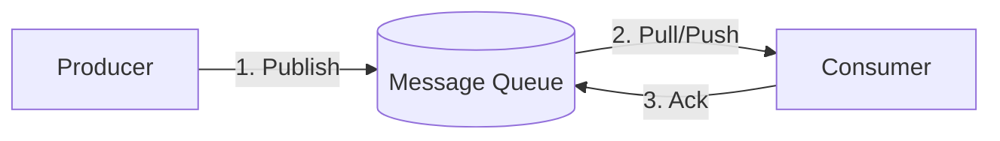

# 1.5 Messaging & Asynchronous Systems (System Design View)

Messaging and asynchronous systems are used to build **reliable, scalable, and decoupled architectures**.

They are a core pillar of large-scale system design.

---

## 1.5.1 Why Asynchronous Processing Exists

### Problem with Purely Synchronous Systems

In synchronous systems:
- The caller **waits** for the callee
- Services form **long dependency chains**
- Failures propagate quickly
- Latency adds up across services
- Traffic spikes can overload downstream systems

**Example (The "Order" Problem):**
Imagine a user clicks "Buy Now". In a synchronous architecture, the server must:
1.  Charge the credit card (External API, 500ms).
2.  Update inventory database (Internal DB, 50ms).
3.  Generate a PDF invoice (CPU intensive, 200ms).
4.  Send a confirmation email (External SMTP, 300ms).
5.  Send data to the analytics warehouse (Internal API, 100ms).

**Total Latency:** ~1.15 seconds.

**The Risks:**
-   **Fragility:** If the Email Service is down, does the whole order fail? In a synchronous system, yes, or you need complex error handling code.
-   **Cascading Failure:** If 10,000 users buy at once, the PDF generator might crash the CPU. This crashes the web server, meaning *no one* can buy anything.
-   **User Experience:** The user stares at a spinner for over a second.

---

### Why Async Is Needed

Asynchronous processing exists to:
- **Decouple** components
- Improve **reliability**
- Absorb **traffic spikes**
- Reduce **user-facing latency**

Core idea:
> Not every operation needs to complete before responding to the user.

**The Async Solution:**
1.  User clicks "Buy Now".
2.  Server validates the order and puts a message `{"order_id": 123}` into a Queue.
3.  Server immediately returns "Order Confirmed" to the user (Latency: 50ms).
4.  Background workers pick up the message later to charge the card, send the email, and generate the PDF.

If the Email service is down, the worker retries later. The user never sees an error.

---

## 1.5.2 Synchronous vs Asynchronous (Design View)

### Synchronous Communication

**Characteristics**
- Caller waits for response
- Tight coupling between services
- Failure propagation
- Easier to reason about

**Analogy: A Phone Call**
When you call a friend, you both must be on the line at the same time. If they don't answer, you can't deliver your message. If they talk slowly, you are stuck holding the phone.

**Examples**
- Login validation
- Fetching user profile
- Checking permissions

**When to Use**
- Immediate response required
- User experience depends on result
- Strong consistency needed

---

### Asynchronous Communication

**Characteristics**
- Caller sends message and continues
- Loose coupling
- Better fault tolerance
- Eventual consistency

**Analogy: Email / Text Message**
You send a text. You don't wait for them to read it. You put your phone away and do laundry. They read and process the message when they are free. If their phone is off, the network stores the text until they come back online.

**Examples**
- Sending emails
- Push notifications
- Logging
- Analytics events

Interview-friendly line:
> “We’ll make non-critical paths asynchronous to improve reliability.”

---

## 1.5.3 Message Queues (Core Concept)

### What Is a Message Queue?

A message queue is a system where:
- **Producers** send messages
- **Consumers** process messages asynchronously
- Messages are stored until processed

The queue acts as a **buffer** between systems.

### Graphical Representation

---

### Why Message Queues Are Useful

1.  **Traffic smoothing (Throttling)**
    -   **Scenario:** A flash sale brings 10,000 requests/sec. Your database can only handle 1,000 writes/sec.
    -   **Without Queue:** Database crashes.
    -   **With Queue:** The queue accepts 10,000 msgs/sec (easy for queues). The consumer reads them at 1,000/sec. The system is slow, but it **survives**.

2.  **Decoupling**
    -   The Producer (Web Server) doesn't need to know IP addresses or API specs of the Consumer (Worker). It just knows the Queue name. You can swap the Consumer implementation (e.g., Python to Go) without touching the Producer.

3.  **Fault tolerance**
    -   If the Consumer crashes, the messages pile up in the queue. When the Consumer restarts, it processes the backlog. No data is lost.

---

## 1.5.4 Queue Processing Model

### Basic Flow

The lifecycle of a message is critical to understand for debugging distributed systems.

1.  **Publish:** The Producer sends a message to the Queue. The Queue persists it to disk (durability).
2.  **Receive (Dequeue):** The Consumer asks for a message. The Queue gives it one.
    -   *Crucial Detail:* The message is **NOT** deleted yet. It is marked as "Invisible" or "Locked" for a specific duration (e.g., 30 seconds). This prevents other consumers from grabbing the same message while the first one is working on it.
3.  **Process:** The Consumer executes the business logic (e.g., resizes the image).
4.  **Acknowledge (Ack):**
    -   **Success:** The Consumer tells the Queue "I'm done." The Queue **permanently deletes** the message.
    -   **Failure (Nack):** The Consumer tells the Queue "I failed." The Queue makes the message visible again for another consumer to try.
    -   **Timeout:** If the Consumer crashes and sends nothing, the "Invisible" timer expires. The Queue assumes failure and makes the message visible again.

You should be able to **draw and explain this flow** in interviews.

---

## 1.5.5 Delivery Semantics (Very Important)

Delivery semantics define **how many times a message may be delivered**.

---

### 1) At-Least-Once Delivery (Most Common)

**Behavior**
- Message is delivered **one or more times**
- Duplicates possible

**Pros**
- High reliability
- No message loss

**Cons**
- Consumers must handle duplicates

**Requirement**
- Consumer must be **idempotent**

**Implementation Method**
- The queue waits for an Ack. If it doesn't get one (network timeout, crash), it redelivers.

**Example**
- Payment processing with idempotency keys

Interview-safe default:
> “At-least-once delivery with idempotent consumers.”

---

### 2) At-Most-Once Delivery

**Behavior**
- Message delivered **at most once**
- Message loss possible

**Pros**
- Simple
- Low latency

**Cons**
- No retries
- Data loss possible

**Implementation Method**
- The queue deletes the message immediately after sending it to the consumer, without waiting for an Ack.

**Use Cases**
- Logging
- Metrics
- Non-critical telemetry

---

### 3) Exactly-Once Delivery

**Behavior**
- Message delivered **exactly once**

**Reality**
- Extremely complex
- Expensive
- Hard to guarantee in distributed systems

**Used Only When**
- Strong correctness is required
- Cost and complexity justified

Interview note:
> Usually avoided; at-least-once + idempotency is preferred.

---

## 1.5.6 Streams vs Queues (Important Distinction)

### Message Queues

**Characteristics**
- Messages are consumed and removed
- Consumers compete for messages
- Focus on task execution

**How it works:**
If you have 5 consumers and 100 messages, the queue distributes them (e.g., 20 each). Once a message is processed, it is gone.

**Examples**
- Background jobs
- Email sending
- Image processing

---

### Event Streams

**Characteristics**
- Messages appended to a log
- Consumers track their own offsets
- Messages retained for configured time

**How it works:**
The stream is an append-only log.
-   Consumer A reads from index 0 to 100.
-   Consumer B reads from index 0 to 100.
-   Both see the same messages.
-   Messages are NOT deleted after reading; they expire after a retention period (e.g., 7 days).

**Examples**
- Activity feeds
- Analytics pipelines
- Event sourcing

---

### Comparison Table

| Aspect | Queue | Stream |
|-----|-----|-----|
| Message retention | Until consumed | Time-based |
| Consumers | Competing | Independent |
| Ordering | Per queue | Per partition |
| Primary use | Tasks | Events |

---

## 1.5.7 Common Technologies

### RabbitMQ
-   **Type:** Traditional Message Queue.
-   **Best For:** Complex routing logic (Pub/Sub, Routing Keys), task queues.
-   **Pros:** Mature, flexible routing, low latency.
-   **Cons:** Harder to scale horizontally than Kafka.

### Apache Kafka
-   **Type:** Distributed Event Streaming Platform.
-   **Best For:** High-throughput data pipelines, logging, event sourcing, analytics.
-   **Pros:** Massive scale (millions of msgs/sec), persistent storage, replayability.
-   **Cons:** Complex to manage, overkill for simple job queues.

### AWS SQS (Simple Queue Service)
-   **Type:** Managed Message Queue.
-   **Best For:** Standard background jobs in AWS.
-   **Pros:** Zero maintenance, infinite scaling, simple API.
-   **Cons:** Cost increases with volume, higher latency than self-hosted.

### Google Cloud Pub/Sub
-   **Type:** Managed Stream/Queue Hybrid.
-   **Best For:** Data ingestion, event-driven systems on GCP.
-   **Pros:** Global (no regions), auto-scaling.

---

## 1.5.8 When to Use Messaging (Design Patterns)

### Use Async Messaging When:
-   **Operation is slow:** PDF generation, video encoding, heavy database queries.
-   **Reliability matters:** You cannot afford to lose the request if a service is temporarily down.
-   **Downstream dependency may fail:** If the 3rd party SMS provider is down, you queue the SMS and retry later.
-   **Load is unpredictable:** Spiky traffic (Black Friday) needs buffering.
-   **Eventual consistency is acceptable:** The user doesn't need to see the result *immediately* (e.g., updating a "Like" count).

Examples:
- Email notifications
- Order processing steps
- Analytics tracking

---

### Do NOT Use Async When:
- Immediate result required
- User experience depends on response
- Strong consistency needed

Examples:
- Login
- Balance check
- Authorization

---

## 1.5.9 Failure Handling & Retries

Failures are normal in distributed systems.

### Common Failures
- Consumer crashes
- Network issues
- Partial processing failures

---

### Retry Strategy

When a message fails, simply retrying immediately is often dangerous (it can hammer a struggling service).

1.  **Immediate Retry:** Try once more instantly. (Good for network blips).
2.  **Fixed Delay:** Wait 5 seconds, then retry.
3.  **Exponential Backoff (Best Practice):** Wait increasing amounts of time.
    -   Attempt 1: Wait 1s
    -   Attempt 2: Wait 2s
    -   Attempt 3: Wait 4s
    -   Attempt 4: Wait 8s
    -   *Why?* This gives the failing system time to recover.
4.  **Jitter:** Add a random number to the wait time (e.g., wait 4.2s instead of 4s). This prevents "Thundering Herd" where all consumers retry at the exact same millisecond.

---

### Dead-Letter Queue (DLQ)

Messages that:
- Fail repeatedly (e.g., after 5 retries)
- Cannot be processed (e.g., malformed JSON)

Are moved to:
- **Dead-letter queue** (a separate queue for "bad" messages).

**Why?**
If you don't move them, the consumer will retry them forever (poison pill), blocking valid messages.

Use cases:
- Debugging
- Manual inspection
- Alerting

Interview-safe phrase:
> “Failed messages go to a dead-letter queue for inspection.”

---

## 1.5.10 Ordering & Idempotency

### Ordering

- Some systems require strict ordering (payments)
- Others don’t (logs)

Trade-off:
- Ordering reduces parallelism
- Ordering hurts scalability

**How it works:**
To guarantee order, messages for a specific entity (e.g., `Order-123`) must go to the **same** shard/partition and be processed by a **single** consumer thread. You cannot process `Order-123` events in parallel.

---

### Idempotency (Critical)

Processing the same message multiple times should:
- NOT duplicate actions
- NOT corrupt state

Techniques:
-   **Idempotency Keys:** The producer generates a unique ID (`UUID`) for the event. The consumer checks a database: `IF exists(ID) return; ELSE process(ID);`.
-   **Database Constraints:** `INSERT INTO transactions (id, amount) ...` will fail if `id` already exists.

Very important in async systems.

---

## 1.5.11 Messaging Anti-Patterns

Avoid:
-   **Using queues for real-time responses:** Don't use a queue if the user is waiting for the result on the screen. It's too slow.
-   **Infinite retries:** Always set a max retry limit. Otherwise, one bad message can clog your system forever.
-   **Queue as a Database:** Do not query the queue for data. It is a transport pipe, not a storage bucket.
-   **Fat Messages:** Don't send a 10MB PDF through the queue. Store the PDF in S3, and send the *link* (reference) in the message.

Design principle:
> Async systems must be observable and resilient.

---

## Key Interview Takeaways

- Async improves reliability and scalability
- Queues decouple producers and consumers
- At-least-once delivery is the practical default
- Idempotency is mandatory
- Streams ≠ queues (events vs tasks)
